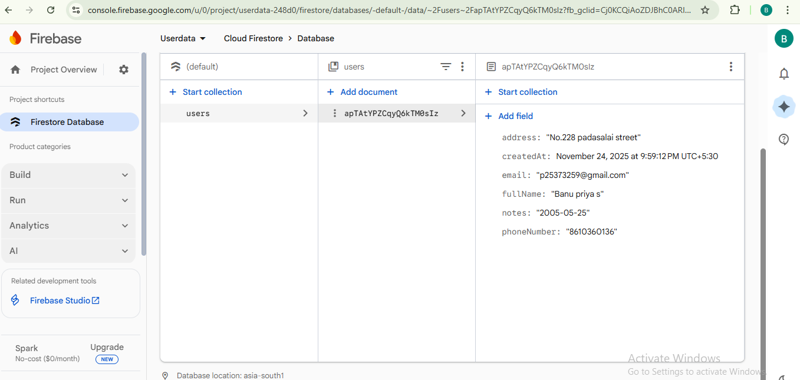

# User Management System (UMS)

This is a simple full-stack User Management System where you can **add**, **view**, **update**, and **delete** users.  
It uses a **Node.js + Express backend**, **Firebase Firestore database**, and a simple **HTML, CSS, JavaScript** frontend.

---

## 📌 Features

### ✔ Add Users  
- Enter user details in the registration form  
- Saves data to Firebase Firestore  

### ✔ View Users  
- Displays all users in a table  
- Shows Name, Email, Contact, and other details  

### ✔ Update Users  
- Edit user details  
- Updates the Firestore record  

### ✔ Delete Users  
- Remove a user record instantly  

### ✔ REST API  
Backend provides complete CRUD API at:  
`https://userregesrationform.onrender.com/api/users`

---

## 🛠 Technologies Used

### **Backend**
- Node.js  
- Express.js  
- Firebase Admin SDK  
- Firestore Database  
- CORS Middleware  

### **Frontend**
- HTML  
- CSS  
- JavaScript (Fetch API)

---

## 📂 Project Structure

- server.js -> Backend API 
- firebase-config.js -> Firebase Admin setup
- serviceAccountKey.json -> Firebase private key 
- main.html -> Home page
- index.html -> Registration page 
- users.html -> User list (View/Update/Delete)
- script.js -> All frontend logic + API calls
- style.css -> Styling for all pages
- package.json -> Node dependencies

## Start Backend
1.Install npm
```bash
npm install
```
2. Run Backend
```bash
node server.js
```
3.Server runs at Backend:
```bash
https://userregesrationform.onrender.com/api/users
```
## Firebase Screenshot

